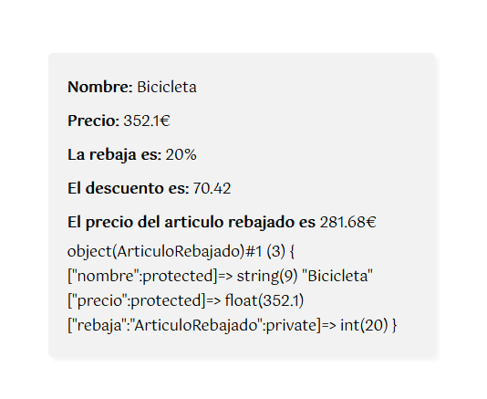

[`⬅️ Volver al Inicio`](https://github.com/13MariaNoguera/Ejercicios1-PHP "Inicio Ejercicios")
 

#  📂 Artículo

### [Articulo.php](https://github.com/13MariaNoguera/Ejercicios1-PHP/tree/master/POO/articulo/Articulo.php "Articulo.php")
En este se crea la clase `Articulo`:
- **Atributos**: `nombre`, `precio`, ambos protected.
   - **Métodos**:
     - **Constructor**: Inicializa los atributos.
     - **To String**: Método que devuelve los datos en formato HTML.
     - **Getter Precio**: Método que recoge el valor `precio` del objeto.
     - **Setter Precio**: Método que cambia el valor `precio` del objeto por el que se le pasa.

[`➡️ Ver código`](https://github.com/13MariaNoguera/Ejercicios1-PHP/tree/master/POO/articulo/Articulo.php "Articulo.php")

---

### [ArticuloRebajado.php](https://github.com/13MariaNoguera/Ejercicios1-PHP/tree/master/POO/articulo/ArticuloRebajado.php "ArticuloRebajado.php")
En este se crea la clase `ArticuloRebajado` que hereda de la clase `Articulo`:

- **Atributo adicional**: `rebaja`.
   - **Métodos**:
     - **Constructor**: Llama al constructor de `Articulo` y agrega `rebaja`.
     - **Calcula Descuento**: Método que devuelve el precio por la rebaja dividido por 100.
     - **Precio Rebajado**: Método que devuelve la diferencia entre el precio y el descuento.
     - **To String**: Método que devuelve los datos en formato HTML.
  
[`➡️ Ver código`](https://github.com/13MariaNoguera/Ejercicios1-PHP/tree/master/POO/articulo/ArticuloRebajado.php "ArticuloRebajado.php")

---

### [index.php](https://github.com/13MariaNoguera/Ejercicios1-PHP/tree/master/POO/articulo/index.php "index.php")
Este es el archivo principal donde se instancia el objeto de la clase `ArticuloRebajado`, se muestra la siguiente información por pantalla:

1. Creación de un objeto `ArticuloRebajado`.
2. Llamada al objeto para mostrar los datos en formato HTML del objeto creado.
3. Uso de la función `var_dump()` para mostrar la información del objeto.
 

[`➡️ Ver código`](https://github.com/13MariaNoguera/Ejercicios1-PHP/tree/master/POO/articulo/index.php "index.php")

---

[`⬅️ Volver a POO`](https://github.com/13MariaNoguera/Ejercicios1-PHP/tree/master/POO "POO")