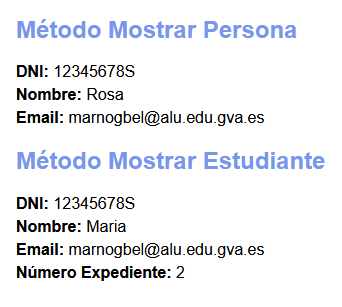

[`⬅️ Volver al Inicio`](https://github.com/13MariaNoguera/Ejercicios1-PHP "Inicio Ejercicios")
 

#  📂 Clases

### [Persona.php](https://github.com/13MariaNoguera/Ejercicios1-PHP/tree/master/POO/clases/Persona.php "Persona.php")
En este se crea la clase `Persona`:
- **Atributos**: `dni`, `nombre`, `email`.
   - **Métodos**:
     - **Constructor**: Inicializa los atributos.
     - **Getters y Setters**: Métodos para acceder y modificar los valores de los atributos.
     - **Mostrar**: Devuelve los datos en formato HTML.

[`➡️ Ver código`](https://github.com/13MariaNoguera/Ejercicios1-PHP/tree/master/POO/clases/Persona.php "Persona.php")

---

### [Estudiante.php](https://github.com/13MariaNoguera/Ejercicios1-PHP/tree/master/POO/clases/Estudiante.php "Estudiante.php")
En este se crea la clase `Estudiante`:

- **Atributo adicional**: `numExpediente`.
   - **Métodos**:
     - **Constructor**: Llama al constructor de `Persona` y agrega `numExpediente`.
     - **Getter y Setter**: Para `numExpediente`.
     - **Mostrar**: Devuelve los datos en HTML, incluyendo `numExpediente`.

[`➡️ Ver código`](https://github.com/13MariaNoguera/Ejercicios1-PHP/tree/master/POO/clases/Estudiante.php "Estudiante.php")

---

### [Clases.php](https://github.com/13MariaNoguera/Ejercicios1-PHP/tree/master/POO/clases/Clases.php "Clases.php")
Este es el archivo principal donde se instancian los objetos de `Persona` y `Estudiante`, se modifican algunos atributos y se muestra la información en pantalla:

1. Creamos un objeto `Persona` y un objeto `Estudiante`.
2. Usamos a algún `setter` para cambiar el valor de algún atributo, en este caso el `nombre` de la clase `Persona`.
3. Llamamos al método `Mostrar` de cada objeto para visualizar la información en HTML.
 

[`➡️ Ver código`](https://github.com/13MariaNoguera/Ejercicios1-PHP/tree/master/POO/clases/Clases.php "Clases.php")

---

[`⬅️ Volver a POO`](https://github.com/13MariaNoguera/Ejercicios1-PHP/tree/master/POO "POO")