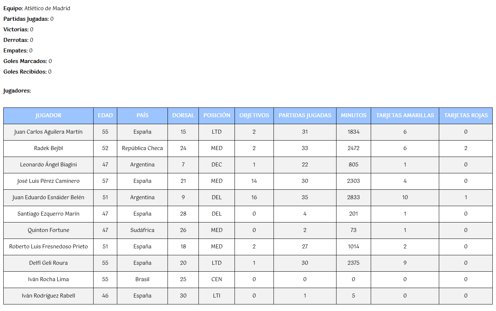

[`⬅️ Volver al Inicio`](https://github.com/13MariaNoguera/Ejercicios1-PHP "Inicio Ejercicios")
 

#  📂 Player

### [Player.php](https://github.com/13MariaNoguera/Ejercicios1-PHP/tree/master/POO/player/Player.php "Player.php")
En este se crea la clase `Player`:
- **Atributos**: `name`, `lastName`, `birthday`, `country`, `dorsal`, `position`, `goals`, `matches`, `minutes`, `yellowCard`, `redCard`.
   - **Métodos**:
     - **Constructor**: Inicializa los atributos.
     - **Age**: Métodos que devuelve la edad del jugar a través del atributo `birthday`.
     - **Score**: Método para añadir goles al jugador.
     - **AddCard(Color)**: Método para añadir una tarjeta (amarilla o roja) al jugador.
     - **PlayMinutes(Min)**: Método para añadir minutos jugados al jugador.
     - **Render**:  Método para mostrar la ficha del jugador.

[`➡️ Ver código`](https://github.com/13MariaNoguera/Ejercicios1-PHP/tree/master/POO/player/Player.php "Player.php")

---

### [Team.php](https://github.com/13MariaNoguera/Ejercicios1-PHP/tree/master/POO/player/Team.php "Team.php")
En este se crea la clase `Estudiante`:

- **Atributos**: `name`, `players`, `matches`, `won`, `lost`, `tie`, `scoreGoals`, `concededGoals`.
   - **Métodos**:
     - **Constructor**: Inicializa los atributos.
     - **Render**: Método para mostrar el equipo.
     - **SignPlayer**: Método para añadir un jugador al equipo;

[`➡️ Ver código`](https://github.com/13MariaNoguera/Ejercicios1-PHP/tree/master/POO/player/Team.php "Team.php")

---

### [index.php](https://github.com/13MariaNoguera/Ejercicios1-PHP/tree/master/POO/player/index.php "index.php")
Este es el archivo principal donde se instancian los objetos de `Player` y `Team` y donde se lee el fichero `plantillas.csv`:

1. Se crea un objeto de tipo `Team` y se le da el nombre del equipo solicitado (Atlético de Madrid).
2. Se recorren los datos con un `foreach` y se van añadiendo con el método `SignPlayer` los jugadores.
3. Se visualiza la plantilla con el método `Render`.
 

[`➡️ Ver código`](https://github.com/13MariaNoguera/Ejercicios1-PHP/tree/master/POO/player/index.php "index.php")

---

[`⬅️ Volver a POO`](https://github.com/13MariaNoguera/Ejercicios1-PHP/tree/master/POO "POO")