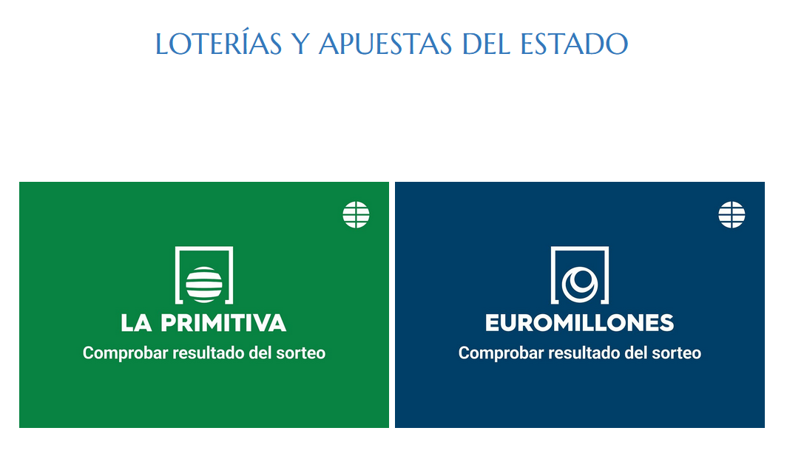
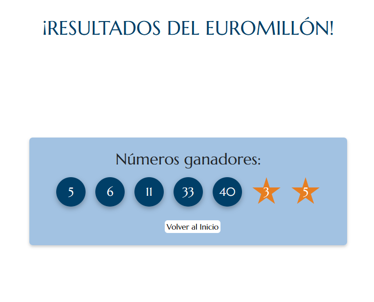
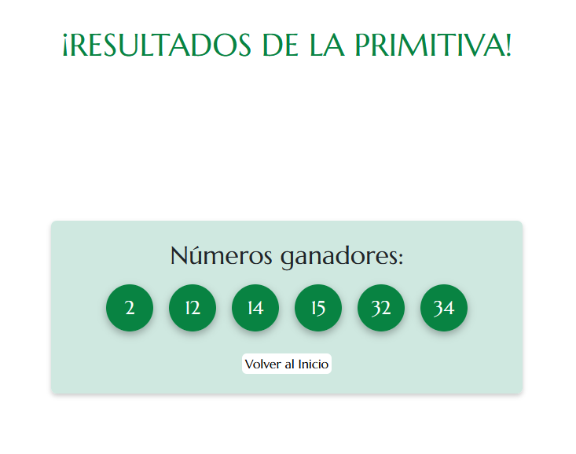

[`⬅️ Volver al Inicio`](https://github.com/13MariaNoguera/Ejercicios1-PHP "Inicio Ejercicios")
 

#   📝 Visualización Apuestas del Estado
 

### 1️⃣   [selec_apuesta.html](https://github.com/13MariaNoguera/Ejercicios1-PHP/tree/master/apuestasEstado/selec_apuesta.html "Apuestas del Estado")
Este archivo HTML permite al usuario seleccionar entre dos tipos de apuestas: Primitiva o Euromillones. Al hacer clic en uno de los enlaces, se redirige al script correspondiente para generar una apuesta.

---

### 2️⃣   [euromillones.php](https://github.com/13MariaNoguera/Ejercicios1-PHP/blob/master/apuestasEstado/euromillones.php "Euromillones")
Este script PHP genera una apuesta aleatoria para el juego de Euromillones. La apuesta consiste en 5 números seleccionados entre 1 y 50, además de 2 estrellas entre 1 y 9. Los números y estrellas generados se muestran de forma ordenada.

---

### 3️⃣   [primitiva.php](https://github.com/13MariaNoguera/Ejercicios1-PHP/blob/master/apuestasEstado/primitiva.php "Primitiva")
Este script PHP genera una apuesta aleatoria para el juego de la Primitiva. La apuesta consiste en 6 números seleccionados entre 1 y 49, mostrados de manera ordenada en pantalla.

---