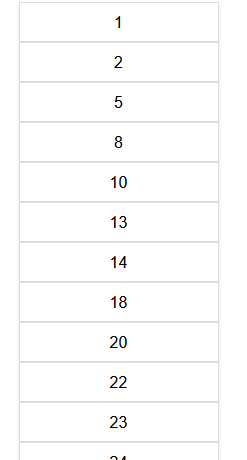
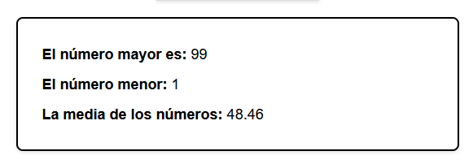
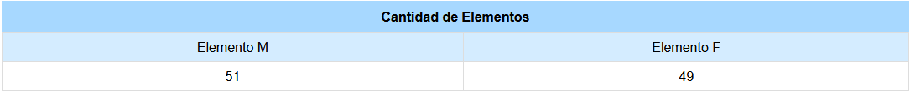
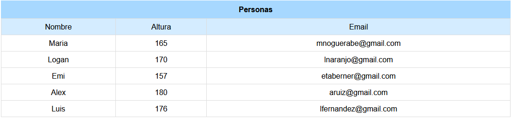
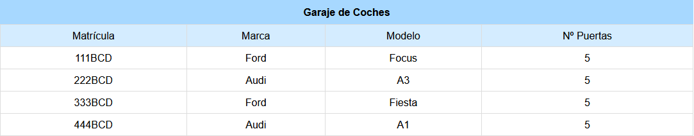
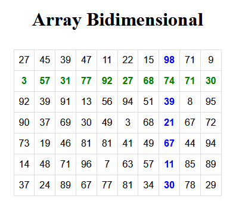

[`⬅️ Volver al Inicio`](https://github.com/13MariaNoguera/Ejercicios1-PHP "Inicio Ejercicios")
 

# 📝 Visualización Ejercicios de Arrays

### 1️⃣ [1_array1.php](https://github.com/13MariaNoguera/Ejercicios1-PHP/blob/master/array/1_array1.php "1_array1.php")
En este ejercicio se genera un array con 50 números aleatorios comprendidos entre 0 y 99.

__Objetivo:__
- Asegurarse de que no haya números repetidos.
- Mostrar el array en una lista desordenada.
- Ordenar los números.
- Calcular el mayor, el menor y la media de los valores.

[`➡️ Ver código`](https://github.com/13MariaNoguera/Ejercicios1-PHP/blob/master/array/1_array1.php "1_array1.php")

---

### 2️⃣ [2_arrayAsociativo.php](https://github.com/13MariaNoguera/Ejercicios1-PHP/blob/master/array/2_arrayAsociativo.php "2_arrayAsociativo.php")
Este ejercicio llena un array con 100 valores aleatorios que son ‘M’ o ‘F’. Luego, cuenta cuántas veces aparece cada uno, almacenando los resultados en un array asociativo, por ejemplo: `('M' => 44, 'F' => 66)`.

[`➡️ Ver código`](https://github.com/13MariaNoguera/Ejercicios1-PHP/blob/master/array/2_arrayAsociativo.php "2_arrayAsociativo.php")

---

### 3️⃣ [3_personas.php](https://github.com/13MariaNoguera/Ejercicios1-PHP/blob/master/array/3_personas.php "3_personas.php")
Mediante un `array bidimensional`, se almacena el nombre, la altura y el email de 5 personas. El array es una colección de arrays asociativos, y la información se presenta en una tabla HTML.

[`➡️ Ver código`](https://github.com/13MariaNoguera/Ejercicios1-PHP/blob/master/array/3_personas.php "3_personas.php")

---

### 4️⃣ [4_garaje.php](https://github.com/13MariaNoguera/Ejercicios1-PHP/blob/master/array/4_garaje.php "4_garaje.php")
Este ejercicio define un `array bidimensional mixto`. La primera dimensión es asociativa y utiliza matrículas de coches como claves. En la segunda dimensión, se almacena la marca, modelo y número de puertas de cada coche.

[`➡️ Ver código`](https://github.com/13MariaNoguera/Ejercicios1-PHP/blob/master/array/4_garaje.php "4_garaje.php")

---

### 5️⃣ [5_arrayBidimensional.php](https://github.com/13MariaNoguera/Ejercicios1-PHP/blob/master/array/5_arrayBidimensional.php "5_arrayBidimensional.php")
Se rellena un `array bidimensional` de 6 filas por 9 columnas con números aleatorios entre 100 y 999 (sin repetirse). Se muestra el contenido en una tabla, destacando:
- La columna con el número máximo en azul.
- La fila con el número mínimo en verde.
- El resto de los números en negro.

[`➡️ Ver código`](https://github.com/13MariaNoguera/Ejercicios1-PHP/blob/master/array/5_arrayBidimensional.php "5_arrayBidimensional.php")

---