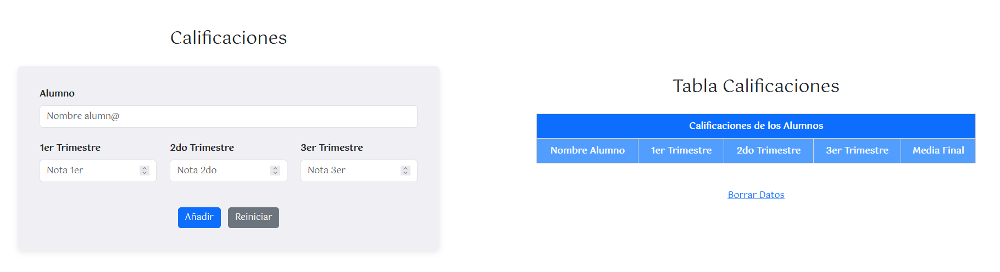
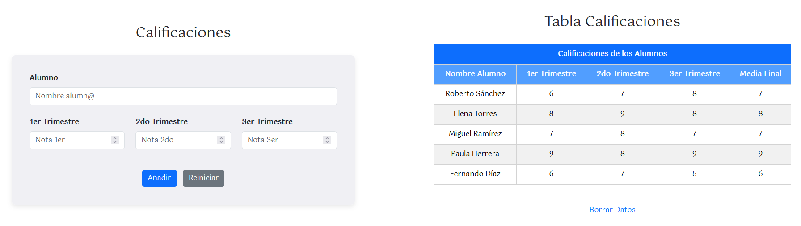

[`⬅️ Volver al Inicio`](https://github.com/13MariaNoguera/Ejercicios1-PHP "Inicio Ejercicios")
 

# 📂 Calificaciones

### [calificaciones.php](https://github.com/13MariaNoguera/Ejercicios1-PHP/tree/master/cookiesYsesiones/calificaciones "calificaciones.php")
Este archivo contiene toda la estructura necesaria para gestionar las calificaciones. Aquí se crea la sesión `$_SESSION["calificaciones"]`, donde se almacenarán todos los registros añadidos, permitiéndonos posteriormente mostrar los datos guardados.

[`➡️ Ver código`](https://github.com/13MariaNoguera/Ejercicios1-PHP/tree/master/cookiesYsesiones/calificaciones/calificaciones.php "calificaciones.php")

---

### [calificaciones.view.php](https://github.com/13MariaNoguera/Ejercicios1-PHP/tree/master/cookiesYsesiones/calificaciones "calificaciones.view.php")
Esta es la vista del archivo `calificaciones.php`, donde se rellenará el formularario de calificaciones. Al hacer clic en el botón `Añadir`, las calificaciones se añadirán automáticamente a la tabla correspondiente. Además, encontramos el botón `Reiniciar`, que permite borrar el contenido introducido en el formulario. Finalmente, debajo de la tabla, se encuentra el enlace  `Borrar Datos`, el cual, al ser seleccionado, elimina los datos de la tabla de calificaciones.

[`➡️ Ver código`](https://github.com/13MariaNoguera/Ejercicios1-PHP/blob/master/cookiesYsesiones/calificaciones/calificaciones.view.php "calificaciones.view.php")

---

### [borrarDatos.php](https://github.com/13MariaNoguera/Ejercicios1-PHP/tree/master/cookiesYsesiones/calificaciones "borrarDatos.php")
Este al hacer clic en el enlace `Borrar Datos` del anterior archivo (`calificaciones.view.php`) permitirá eliminar todos los registros añadidos a la tabla de calificaciones.

[`➡️ Ver código`](https://github.com/13MariaNoguera/Ejercicios1-PHP/blob/master/cookiesYsesiones/calificaciones/borrarDatos.php "borrarDatos.php")

---

[`⬅️ Volver a las Cookies y Sesiones`](https://github.com/13MariaNoguera/Ejercicios1-PHP/tree/master/formularios "Cookies y Sesiones")