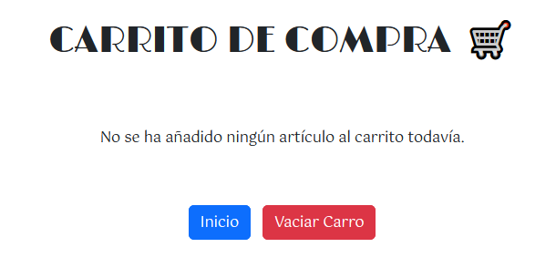
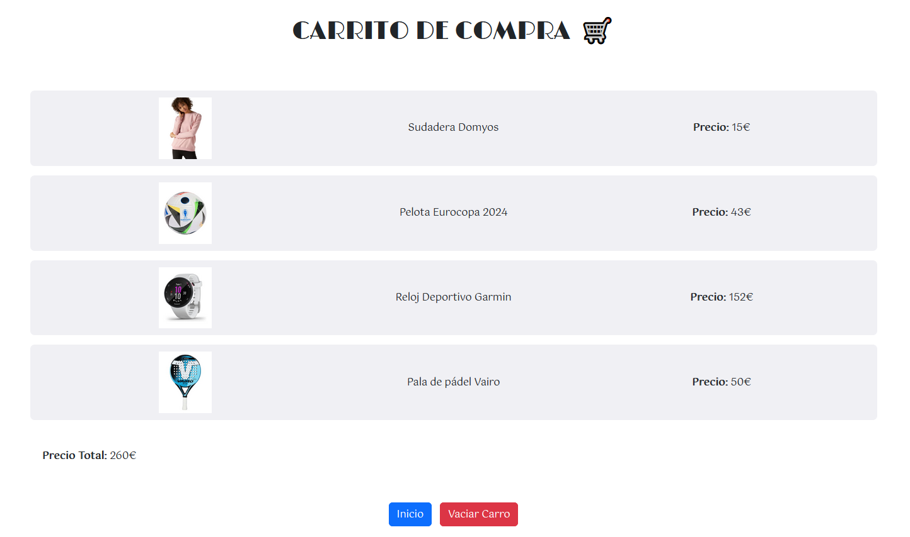

[`⬅️ Volver al Inicio`](https://github.com/13MariaNoguera/Ejercicios1-PHP "Inicio Ejercicios")
 

#  📂 Carro

### [carro.php](https://github.com/13MariaNoguera/Ejercicios1-PHP/tree/master/cookiesYsesiones/carro/carro.php "carro.php")
Es un script que trabaja con sesiones. Se crea un array `$artículos` que contiene el ID, el nombre, el precio y la foto de cada artículo. Además comprueba que la sesión esté creada, si no lo está se crea como un array.

[`➡️ Ver código`](https://github.com/13MariaNoguera/Ejercicios1-PHP/tree/master/cookiesYsesiones/carro/carro.php "carro.php")

---

### [carro.view.php](https://github.com/13MariaNoguera/Ejercicios1-PHP/tree/master/cookiesYsesiones/carro/carro.view.php "carro.view.php")
Es la vista de la tienda. Donde hay unos botones para añadir artículos al carrito y también te permite con el botón de carrito acceder a él.

[`➡️ Ver código`](https://github.com/13MariaNoguera/Ejercicios1-PHP/tree/master/cookiesYsesiones/carro/carro.view.php "carro.view.php")

---

### [carroTotal.php](https://github.com/13MariaNoguera/Ejercicios1-PHP/tree/master/cookiesYsesiones/carro/carroTotal.php "carroTotal.php")
Es la vista del carrito donde se almacenan todos los artículos añadidos anteriormente con los botones del archivo `carro.view.php`.

**Carro Vacío:**

**Carro Con Artículos:**

[`➡️ Ver código`](https://github.com/13MariaNoguera/Ejercicios1-PHP/tree/master/cookiesYsesiones/carro/carro.view.php "carro.view.php")

---

### [cerrarSesion.php](https://github.com/13MariaNoguera/Ejercicios1-PHP/tree/master/cookiesYsesiones/carro/cerrarSesion.php "cerrarSesion.php")
Es el script que `'destruye'` la sesión. Se podrá acceder a este cuando el botón `Vaciar Carrito` se marque.

[`➡️ Ver código`](https://github.com/13MariaNoguera/Ejercicios1-PHP/tree/master/cookiesYsesiones/carro/cerrarSesion.php "cerrarSesion.php")

---

[`⬅️ Volver a las Cookies y Sesiones`](https://github.com/13MariaNoguera/Ejercicios1-PHP/tree/master/cookiesYsesiones "Cookies y Sesiones")