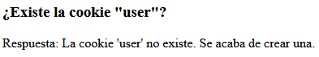
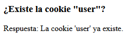

[`⬅️ Volver al Inicio`](https://github.com/13MariaNoguera/Ejercicios1-PHP "Inicio Ejercicios")
 

## 🍪 Visualización Ejercicio Cookies
---

### [cookies.php](https://github.com/13MariaNoguera/Ejercicios1-PHP/tree/master/cookiesYsesiones/cookies/cookies.php "cookies.php")
Este archivo contiene un script en PHP que:
- Verifica si una cookie existe.
- Si no existe, crea una cookie con una caducidad de 1000 segundos.
- Muestra mensajes relevantes dependiendo de si la cookie fue creada o ya existía.
  
---

### [cookies.view.php](https://github.com/13MariaNoguera/Ejercicios1-PHP/tree/master/cookiesYsesiones/cookies/cookies.view.php "cookies.view.php")

El archivo [`cookies.view.php`](https://github.com/13MariaNoguera/Ejercicios1-PHP/blob/master/cookiesYsesiones/cookies/ejcookies.php "cookies.view.php") muestra cómo se ve la aplicación en el navegador:

- Si exite la cookie:

- Si no existe la cookie:

---

[`⬅️ Cookies y Sesiones`](https://github.com/13MariaNoguera/Ejercicios1-PHP/blob/master/cookiesYsesiones "Cookies y Sesiones")
