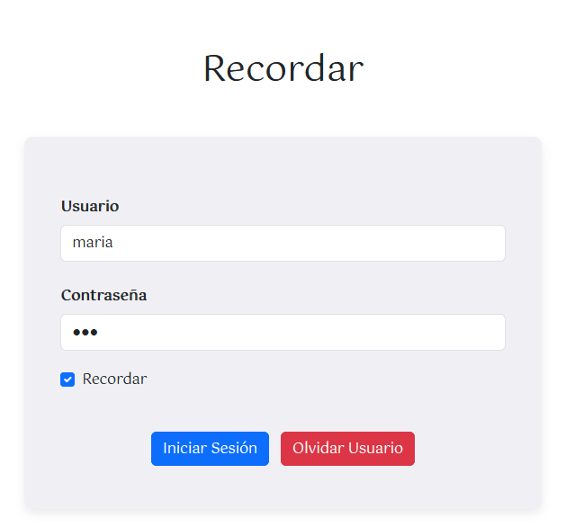
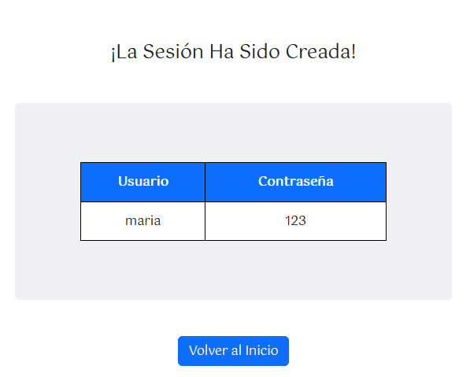
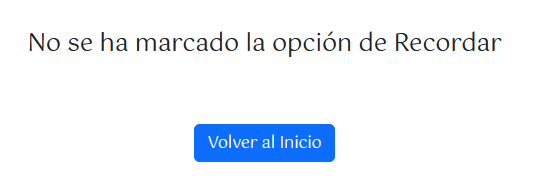

[`⬅️ Volver al Inicio`](https://github.com/13MariaNoguera/Ejercicios1-PHP "Inicio Ejercicios")
 

# 📂 Recordar

### [recordar.php](https://github.com/13MariaNoguera/Ejercicios1-PHP/tree/master/cookiesYsesiones/recordar/recordar.php "recordar.php")
Este archivo comprueba si se ha marcado la casilla de "Recordar". Si está marcada, el usuario y la contraseña se guardarán en variables de sesión.

---

### [olvidarUsuario.php](https://github.com/13MariaNoguera/Ejercicios1-PHP/blob/master/cookiesYsesiones/recordar/olvidarUsuario.php "olvidarUsuario.php")
Este script elimina la sesión del usuario que previamente había seleccionado la opción "Recordar".

---

### [recordar.view.php](https://github.com/13MariaNoguera/Ejercicios1-PHP/blob/master/cookiesYsesiones/recordar/olvidarUsuario.php "cookies.view.php")
Es una interfaz de Login que incluye:
- Un campo para usuario y contraseña.
- Una casilla para recordar la sesión (usuario y contraseña).
- Un botón para iniciar sesión y otro para "olvidar" al usuario (eliminar la sesión).
  

---

### [sesionCreada.view.php](https://github.com/13MariaNoguera/Ejercicios1-PHP/blob/master/cookiesYsesiones/recordar/sesionCreada.view.php "sesionCreada.view.php")
Se mostrará cuando el usuario haya marcado la casilla de recordar y haya iniciado sesión.

---

### [sesionNoCreada.view.php](https://github.com/13MariaNoguera/Ejercicios1-PHP/blob/master/cookiesYsesiones/recordar/sesionNoCreada.view.php "sesionNoCreada.view.php")
Esta vista se mostrará cuando el usuario no ha marcado la casilla de recordar, pero aún así ha iniciado sesión.

---

[`⬅️ Volver a las Cookies y Sesiones`](https://github.com/13MariaNoguera/Ejercicios1-PHP/blob/master/cookiesYsesiones "Cookies y Sesiones")