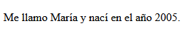
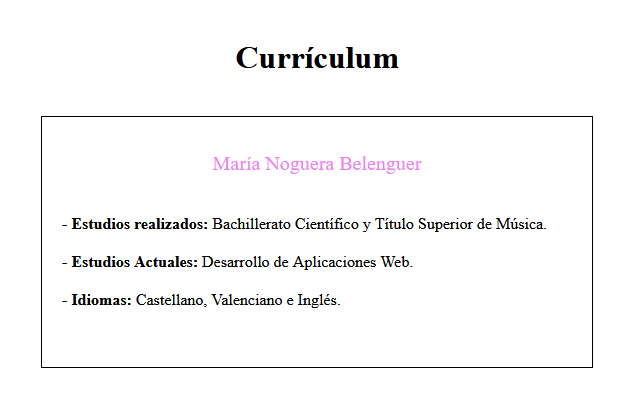
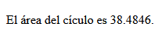
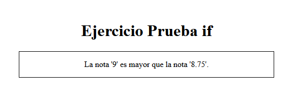
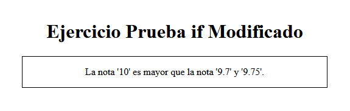
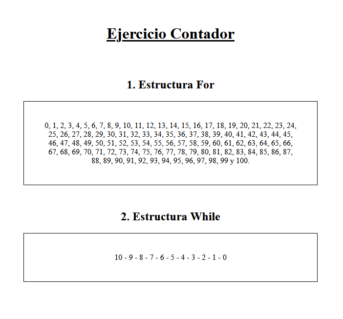
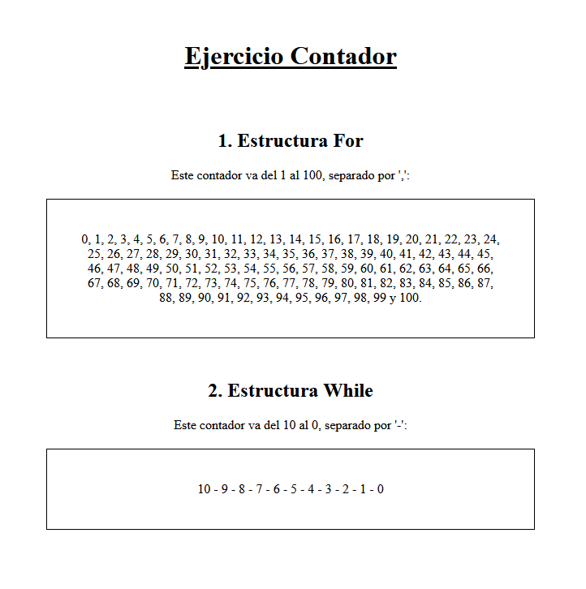

[`⬅️ Volver al Inicio`](https://github.com/13MariaNoguera/Ejercicios1-PHP "Inicio Ejercicios")
 

# 📝 Visualización Ejercicios Básicos

### 1️⃣   [info_basica.php](https://github.com/13MariaNoguera/Ejercicios1-PHP/blob/master/ejercicios1/info_basica.php "info_basica.php")
Este ejercicio muestra una frase con mi nombre y mi año de nacimiento usando variables en PHP. Se trata de un ejemplo simple para practicar cómo almacenar datos en variables y mostrarlos dentro de un texto HTML generado dinámicamente desde PHP.

[`➡️ Ver código`](https://github.com/13MariaNoguera/Ejercicios1-PHP/blob/master/ejercicios1/info_basica.php "info_basica.php")

---

### 2️⃣   [curriculum.php](https://github.com/13MariaNoguera/Ejercicios1-PHP/blob/master/ejercicios1/curriculum.php "curriculum.php")
Este ejercicio muestra una página web con parte de mi currículum utilizando variables en PHP. El archivo `curriculum.php` contiene información básica como los estudios realizados y los idiomas que hablo.

[`➡️ Ver código`](https://github.com/13MariaNoguera/Ejercicios1-PHP/blob/master/ejercicios1/curriculum.php "curriculum.php")

---

### 3️⃣   [area_circulo.php](https://github.com/13MariaNoguera/Ejercicios1-PHP/blob/master/ejercicios1/area_circulo.php "area_circulo.php")
En este ejercicio, se calcula el área de un círculo en base a un valor de radio definido en una variable. El archivo `area_circulo.php` contiene una variable `$radio` con el valor de 3.5 y utiliza una constante para definir el valor de PI.

Se lleva a cabo el cálculo del área utilizando la fórmula: `Área = PI * radio²`.

El código define la constante `PI` y calcula el área almacenando el resultado en una nueva variable.

[`➡️ Ver código`](https://github.com/13MariaNoguera/Ejercicios1-PHP/blob/master/ejercicios1/area_circulo.php "area_circulo.php")

---

### 4️⃣   [prueba_if.php](https://github.com/13MariaNoguera/Ejercicios1-PHP/blob/master/ejercicios1/prueba_if.php "prueba_if1.php")
Este ejercicio utiliza condicionales `if..else` en PHP para comparar dos notas de examen almacenadas en variables. El archivo prueba_if.php contiene dos variables: `$nota1` y `$nota2`, a las que se les asignan valores numéricos (que pueden incluir decimales). 

__Objetivo:__  Determinar cuál de las dos notas es mayor o si ambas son iguales.

[`➡️ Ver código`](https://github.com/13MariaNoguera/Ejercicios1-PHP/blob/master/ejercicios1/prueba_if.php "prueba_if1.php")

---

### 5️⃣   [prueba_if2.php](https://github.com/13MariaNoguera/Ejercicios1-PHP/blob/master/ejercicios1/prueba_if2.php "prueba_if2.php")
Este ejercicio amplía la lógica condicional de `prueba_if.php`, añadiendo una tercera nota, `$nota3`, para comparar con las otras dos. El archivo `prueba_if2.php` utiliza la estructura `if..elseif..else` para determinar cuál de las tres notas es la mayor.

[`➡️ Ver código`](https://github.com/13MariaNoguera/Ejercicios1-PHP/blob/master/ejercicios1/prueba_if2.php "prueba_if2.php")

---

### 6️⃣   [contador.php](https://github.com/13MariaNoguera/Ejercicios1-PHP/blob/master/ejercicios1/contador.php "contador.php")
Utilizamos una  `estructura for` para contar los números del 1 al 100 (separados por comas), y luego una `estructura while` para contar los números del 10 al 0 (una cuenta atrás, separada por guiones).

[`➡️ Ver código`](https://github.com/13MariaNoguera/Ejercicios1-PHP/blob/master/ejercicios1/contador.php "contador.php")

--- 

### 7️⃣   [contador2.php](https://github.com/13MariaNoguera/Ejercicios1-PHP/blob/master/ejercicios1/contador.php "contador2.php")
Modificación del ejercicio anterior.

`Adiciones:`
- Algún H1
- Párrafos Explicativos.
  

[`➡️ Ver código`](https://github.com/13MariaNoguera/Ejercicios1-PHP/blob/master/ejercicios1/contador.php "contador2.php")

---