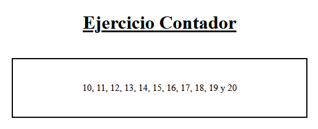
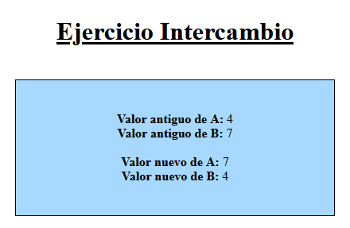

[`⬅️ Volver al Inicio`](https://github.com/13MariaNoguera/Ejercicios1-PHP "Inicio Ejercicios")
 

# 📝 Visualización Funciones Básicas 1

### 1️⃣ [1_contador.php](https://github.com/13MariaNoguera/Ejercicios1-PHP/blob/master/ejercicios2/1_contador.php)
Este ejercicio define una función llamada `cuenta($a, $b)` que recibe dos parámetros numéricos y cuenta desde el valor de `$a` hasta el valor de `$b`, separando cada número con una coma. Luego, se prueba la función contando desde 10 hasta 20.

[`➡️ Ver código`](https://github.com/13MariaNoguera/Ejercicios1-PHP/blob/master/ejercicios2/1_contador.php "1_contador.php")

---

### 2️⃣ [2_intercambia.php](https://github.com/13MariaNoguera/Ejercicios1-PHP/blob/master/ejercicios2/2_intercambia.php)
En este ejercicio se añade una función llamada `intercambia($a, $b)` que recibe dos parámetros por referencia. La función intercambia los valores de `$a` y `$b`, de modo que al final el valor de `$a` pasa a `$b` y viceversa. Se muestra el resultado antes y después del intercambio de valores.

[`➡️ Ver código`](https://github.com/13MariaNoguera/Ejercicios1-PHP/blob/master/ejercicios2/2_intercambia.php "2_intercambia.php")

---