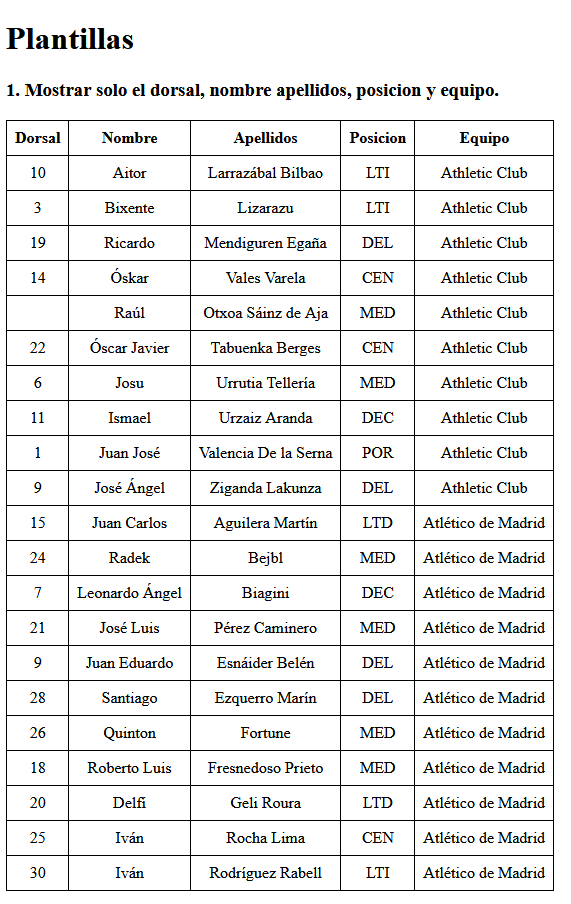
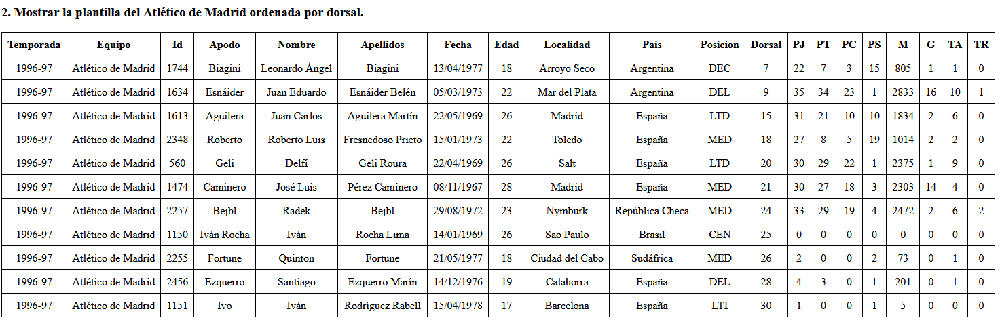
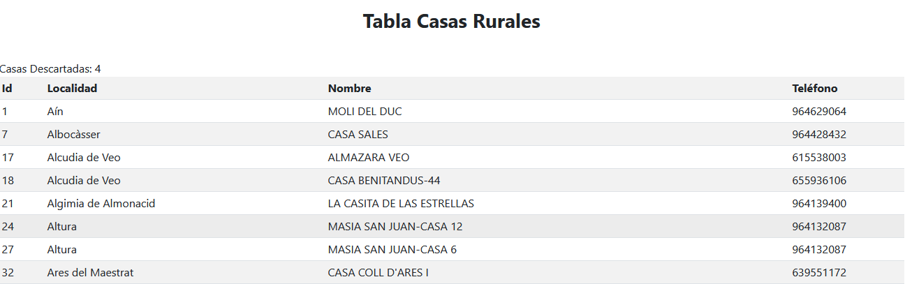
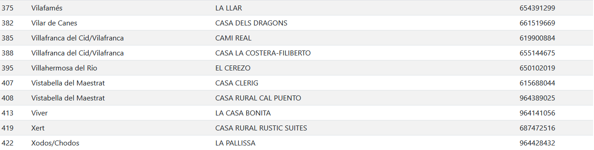

[`⬅️ Volver al Inicio`](https://github.com/13MariaNoguera/Ejercicios1-PHP "Inicio Ejercicios")
 

# 📝 Visualización Ficheros CSV

### 1️⃣ [1_plantilla.php](https://github.com/13MariaNoguera/Ejercicios1-PHP/blob/master/ficherosCSV/1_plantilla.php "1_plantilla.view.php")
Este ejercicio lee los datos de un archivo CSV llamado `plantillas.csv` y los muestra en una tabla HTML. La tabla solo incluye las siguientes columnas: Dorsal, Nombre, Apellidos, Posición y Equipo. Además, se muestra la plantilla del Atlético de Madrid ordenada por el número de dorsal.

[`➡️ Ver código`](https://github.com/13MariaNoguera/Ejercicios1-PHP/blob/master/ficherosCSV/1_plantilla.php "1_plantilla.view.php")

---

### 2️⃣ [2_casasRuralesTelefonos.php](https://github.com/13MariaNoguera/Ejercicios1-PHP/blob/master/ficherosCSV/2_casasRuralesTelefonos.php "2_casasRuralesTelefonos.php")
Este ejercicio carga los datos desde un archivo CSV que contiene información sobre casas rurales de la provincia de Castellón. El programa filtra el contenido para mostrar solo las casas rurales que tienen un número de teléfono definido, y muestra las columnas: ID, Localidad, Nombre y Teléfono. Además, el programa indica cuántas casas rurales se han descartado debido a datos nulos (falta de teléfono).

[`➡️ Ver código`](https://github.com/13MariaNoguera/Ejercicios1-PHP/blob/master/ficherosCSV/2_casasRuralesTelefonos.php "2_casasRuralesTelefonos.php")

---