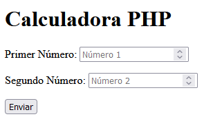

[`⬅️ Volver al Inicio`](https://github.com/13MariaNoguera/Ejercicios1-PHP "Inicio Ejercicios")
 

# 📂 Calculadora

### [1_calculadora.php](https://github.com/13MariaNoguera/Ejercicios1-PHP/tree/master/formularios/Formulario/1_calculadora.php "calculadora.php")

Este archivo es una calculadora simple en PHP que:

- **Recibe** los números `X` e `Y` a través de `$_GET`.
- **Realiza operaciones** básicas: suma, resta, multiplicación y división.
- **Muestra** los resultados de las operaciones en el navegador.
- **Utiliza** un archivo de vista (`calculadora.view.php`) para presentar los resultados de manera ordenada.

[`➡️ Ver código`](https://github.com/13MariaNoguera/Ejercicios1-PHP/tree/master/formularios/Formulario/1_calculadora.php "calculadora.php")

---

### [1_calculadora.view.php](https://github.com/13MariaNoguera/Ejercicios1-PHP/tree/master/formularios/Calculadora/1_calculadora.view.php "1_calculadora.view.php")

[`➡️ Ver código`](https://github.com/13MariaNoguera/Ejercicios1-PHP/tree/master/formularios/Calculadora "1_calculadora.view.php")

---

[`⬅️ Volver a los Formularios`](https://github.com/13MariaNoguera/Ejercicios1-PHP/tree/master/formularios "Formularios")