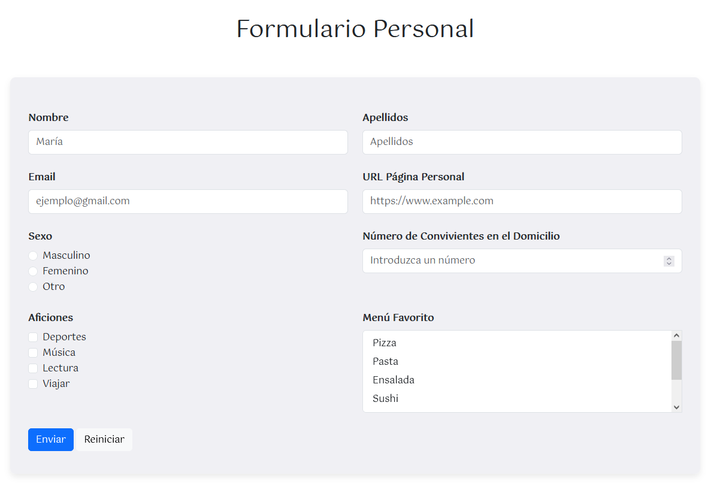
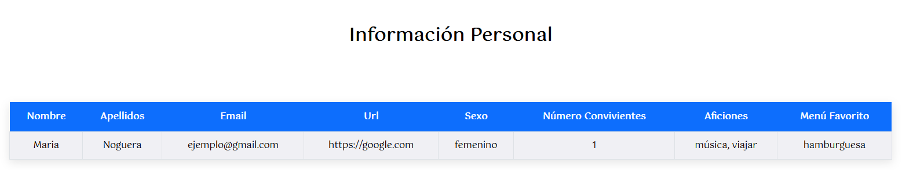

[`⬅️ Volver al Inicio`](https://github.com/13MariaNoguera/Ejercicios1-PHP "Inicio Ejercicios")
 

# 📂 Formulario

### [2_formulario.html](https://github.com/13MariaNoguera/Ejercicios1-PHP/blob/master/formularios/Formulario/2_formulario.html "2_formulario.html")
Este archivo HTML contiene un formulario que solicita al usuario la siguiente información:
- Nombre y apellidos.
- Correo electrónico.
- URL de la página personal.
- Sexo (opciones de radio).
- Número de convivientes en el domicilio.
- Aficiones (opciones de checkbox).
- Menú favorito (lista de selección múltiple).

[`➡️ Ver código`](https://github.com/13MariaNoguera/Ejercicios1-PHP/blob/master/formularios/Formulario/2_formulario.html "2_formulario.html")

---

### [2_formulario.php](https://github.com/13MariaNoguera/Ejercicios1-PHP/blob/master/formularios/Formulario/2_formulario.php "2_formulario.php")
Este script PHP procesa los datos del formulario enviado a través del método POST y los almacena en variables para luego ser mostrados en la vista `2_formulario.view.php`.

[`➡️ Ver código`](https://github.com/13MariaNoguera/Ejercicios1-PHP/blob/master/formularios/Formulario/2_formulario.php "2_formulario.php")

---

### [2_formulario.view.php](https://github.com/13MariaNoguera/Ejercicios1-PHP/blob/master/formularios/Formulario/2_formulario.view.php "2_formulario.view.php")
Este archivo de vista presenta los datos recopilados del formulario en formato de tabla resumen.

[`➡️ Ver código`](https://github.com/13MariaNoguera/Ejercicios1-PHP/blob/master/formularios/Formulario/2_formulario.view.php "2_formulario.view.php")

---

[`⬅️ Volver a los Formularios`](https://github.com/13MariaNoguera/Ejercicios1-PHP/tree/master/formularios "Formularios")