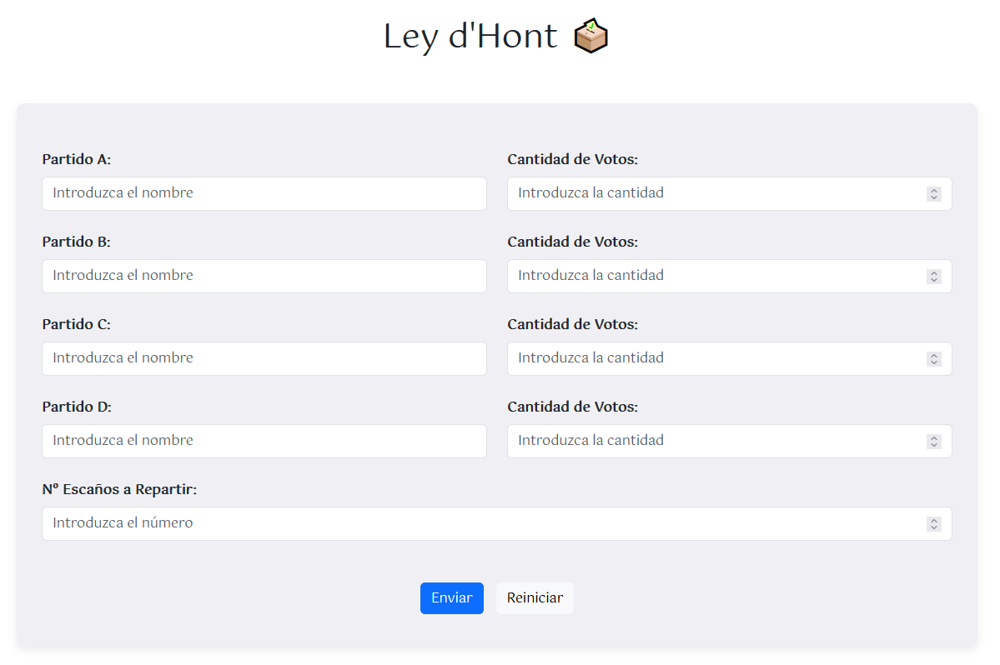
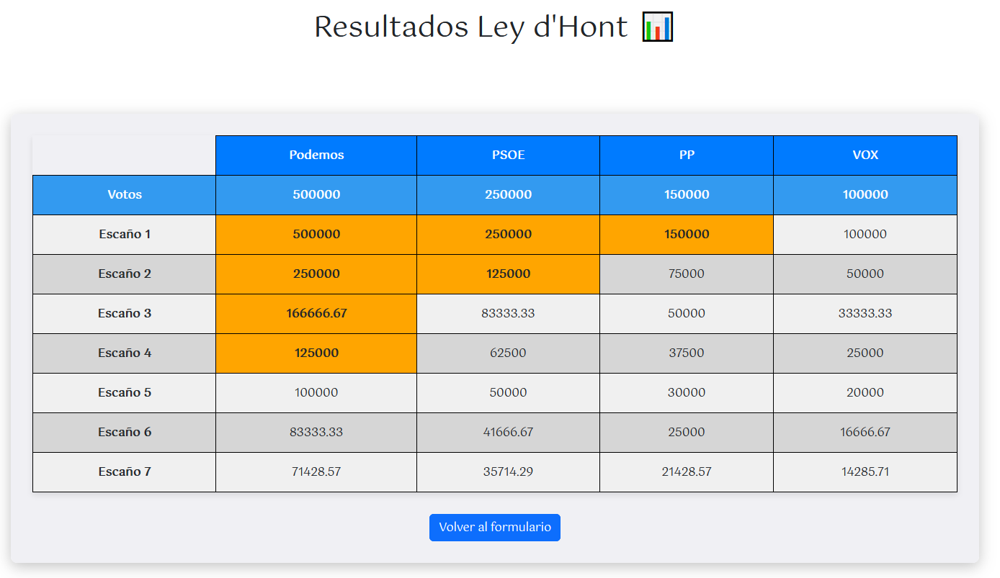

[`⬅️ Volver al Inicio`](https://github.com/13MariaNoguera/Ejercicios1-PHP "Inicio Ejercicios")
 

# 📂 Ley d'Hont

### [hont.html](https://github.com/13MariaNoguera/Ejercicios1-PHP/blob/master/formularios/Ley_d'Hont/hont.html "hont.html")
Este archivo contiene el formulario donde se introducen:

- Número de partidos políticos.
- Cantidad de votos por partido.
- Número de escaños a repartir.

[`➡️ Ver código`](https://github.com/13MariaNoguera/Ejercicios1-PHP/blob/master/formularios/Ley_d'Hont/hont.html "hont.html")

---

### [hont.php](https://github.com/13MariaNoguera/Ejercicios1-PHP/blob/master/formularios/Ley_d'Hont/hont.php "hont.php")
Este script procesa los datos del formulario y calcula:

- **El total de votos de cada partido dividido entre el número de escaños** para generar una tabla con los resultados.

[`➡️ Ver código`](https://github.com/13MariaNoguera/Ejercicios1-PHP/blob/master/formularios/Ley_d'Hont/hont.php "hont.php")

---

### [hont.view.php](https://github.com/13MariaNoguera/Ejercicios1-PHP/blob/master/formularios/Ley_d'Hont/hont.view.php "hont.view.php")
Este archivo presenta los resultados en forma de tabla, mostrando las cantidades más altas de votos por escaño para cada partido.

[`➡️ Ver código`](https://github.com/13MariaNoguera/Ejercicios1-PHP/blob/master/formularios/Ley_d'Hont/hont.view.php "hont.view.php")

---

[`⬅️ Volver a los Formularios`](https://github.com/13MariaNoguera/Ejercicios1-PHP/tree/master/formularios "Formularios")