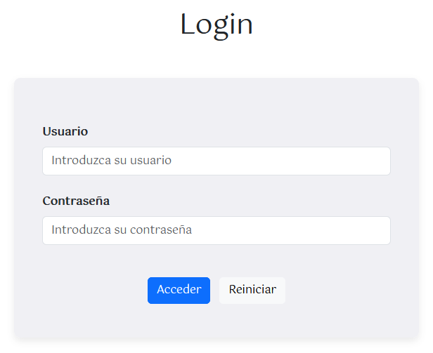
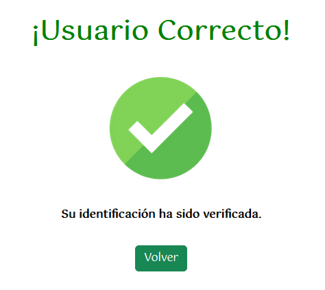
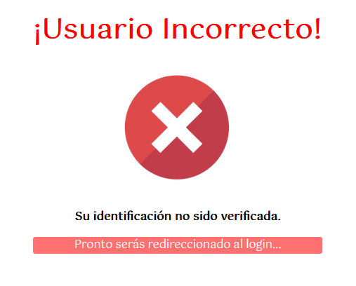

[`⬅️ Volver al Inicio`](https://github.com/13MariaNoguera/Ejercicios1-PHP "Inicio Ejercicios")
 

# 📂 Login

### [3_login.php](https://github.com/13MariaNoguera/Ejercicios1-PHP/blob/master/formularios/Login/3_login.php "3_login.php")
Este archivo contiene el formulario personal que solicita:

- `Usuario`
- `Contraseña`
  

[`➡️ Ver código`](https://github.com/13MariaNoguera/Ejercicios1-PHP/blob/master/formularios/Login/3_login.php "3_login.php")

---

### [3_compruebaLogin.php](https://github.com/13MariaNoguera/Ejercicios1-PHP/blob/master/formularios/Login/3_compruebaLogin.php "3_compruebaLogin.php")
Este script procesa los datos del formulario y verifica si las credenciales son correctas. Utiliza un array asociativo para almacenar los usuarios válidos.

[`➡️ Ver código`](https://github.com/13MariaNoguera/Ejercicios1-PHP/blob/master/formularios/Login/3_compruebaLogin.php "3_compruebaLogin.php")

---

### [ok.php](https://github.com/13MariaNoguera/Ejercicios1-PHP/blob/master/formularios/Login/ok.php "ok.php")
Si las credenciales son correctas, se redirige a esta página, que muestra un mensaje de éxito.

[`➡️ Ver código`](https://github.com/13MariaNoguera/Ejercicios1-PHP/blob/master/formularios/Login/ok.php "ok.php")

---

### [ko.php](https://github.com/13MariaNoguera/Ejercicios1-PHP/blob/master/formularios/Login/ko.php "ko.php")
Si las credenciales son incorrectas, esta página informa al usuario. Se muestra de nuevo el formulario de acceso al pasar 5 segundos.

[`➡️ Ver código`](https://github.com/13MariaNoguera/Ejercicios1-PHP/blob/master/formularios/Login/ko.php "ko.php")

---

[`⬅️ Volver a los Formularios`](https://github.com/13MariaNoguera/Ejercicios1-PHP/tree/master/formularios "Formularios")
