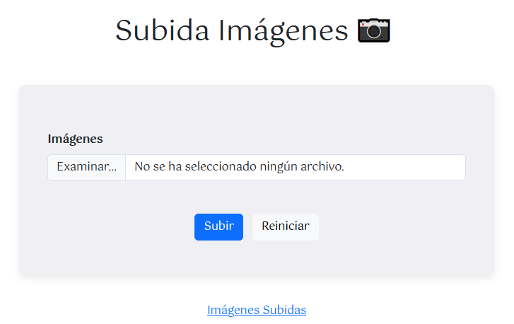
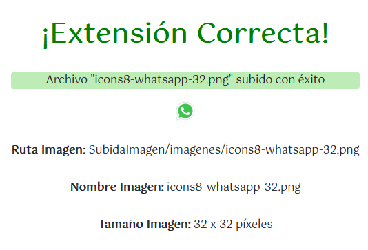
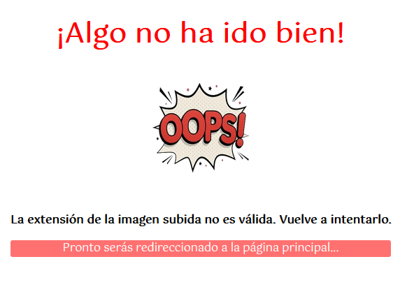

[`⬅️ Volver al Inicio`](https://github.com/13MariaNoguera/Ejercicios1-PHP "Inicio Ejercicios")
 

# 📂 Subida de Imagen

### [4_subidaImagen.html](https://github.com/13MariaNoguera/Ejercicios1-PHP/blob/master/formularios/SubidaImagen/4_subidaImagen.html "4_subidaImagen.html")
Este archivo contiene un formulario que permite a los usuarios subir imágenes. 

[`➡️ Ver código`](https://github.com/13MariaNoguera/Ejercicios1-PHP/blob/master/formularios/SubidaImagen/4_subidaImagen.html "4_subidaImagen.html")

---

### [4_subidaImagen.php](https://github.com/13MariaNoguera/Ejercicios1-PHP/blob/master/formularios/SubidaImagen/4_subidaImagen.php "4_subidaImagen.php")
Este script procesa la imagen subida. Verifica que el tipo de archivo sea una imagen. Si el archivo es válido, muestra la imagen junto con su ruta, nombre, tamaño y dimensiones durante 5 segundos antes de redirigir de nuevo al formulario.

[`➡️ Ver código`](https://github.com/13MariaNoguera/Ejercicios1-PHP/blob/master/formularios/SubidaImagen/4_subidaImagen.php "4_subidaImagen.php")

---

### [4_mensajeError.php](https://github.com/13MariaNoguera/Ejercicios1-PHP/blob/master/formularios/SubidaImagen/4_mensajeError.php "4_mensajeError.php")
Si se sube un archivo que no es una imagen, este script muestra un mensaje de error y permite al usuario intentar nuevamente la subida.

[`➡️ Ver código`](https://github.com/13MariaNoguera/Ejercicios1-PHP/blob/master/formularios/SubidaImagen/4_mensajeError.php "4_mensajeError.php")

---

### [4_imagenesSubidas.php](https://github.com/13MariaNoguera/Ejercicios1-PHP/blob/master/formularios/SubidaImagen/4_imagenesSubidas.php "4_imagenesSubidas.php")
Este script muestra un listado de todas las imágenes que han sido subidas. Utiliza la función `scandir()` para acceder a los archivos en el directorio correspondiente.

[`➡️ Ver código`](https://github.com/13MariaNoguera/Ejercicios1-PHP/blob/master/formularios/SubidaImagen/4_imagenesSubidas.php "4_imagenesSubidas.php")

---

[`⬅️ Volver a los Formularios`](https://github.com/13MariaNoguera/Ejercicios1-PHP/tree/master/formularios "Formularios")