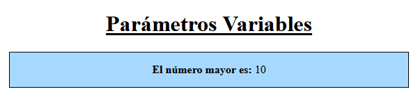
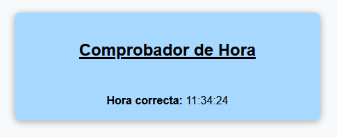
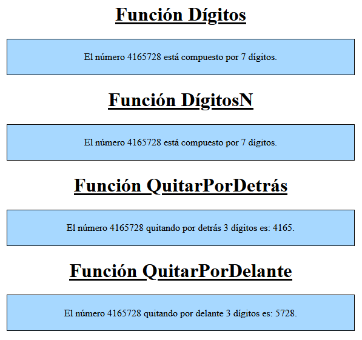

[`⬅️ Volver al Inicio`](https://github.com/13MariaNoguera/Ejercicios1-PHP "Inicio Ejercicios")
 

# 📝 Visualización Funciones Básicas 2

### 1️⃣ [1_parametrosVariables.php](https://github.com/13MariaNoguera/Ejercicios1-PHP/blob/master/funciones/1_parametrosVariables.php "1_parametrosVariables.php")
Este ejercicio crea una función llamada `mayor()` que recibe una cantidad variable de números como parámetros y devuelve el número mayor entre ellos. Para implementar la función, se utilizan funciones internas de PHP como `func_get_args()`.

**Nota:** No se permite usar la función `max()`.

[`➡️ Ver código`](https://github.com/13MariaNoguera/Ejercicios1-PHP/blob/master/funciones/1_parametrosVariables.php "1_parametrosVariables.php")

---

### 2️⃣ [2_compruebaHora.php](https://github.com/13MariaNoguera/Ejercicios1-PHP/blob/master/funciones/2_compruebaHora.php "2_compruebaHora.php")
Este ejercicio toma una cadena de texto que contiene una hora en formato "HH:MM:SS", como por ejemplo `"21:30:12"`. La función procesa la cadena para extraer la hora, minutos y segundos, y verifica si los valores corresponden a una hora válida. Por ejemplo, `"12:63:11"` no sería válida, ya que el minuto 63 no existe.

[`➡️ Ver código`](https://github.com/13MariaNoguera/Ejercicios1-PHP/blob/master/funciones/2_compruebaHora.php "2_compruebaHora.php")

---

### 3️⃣ [3_matematicas.php](https://github.com/13MariaNoguera/Ejercicios1-PHP/blob/master/funciones/3_matematicas.php "3_matematicas.php")
Este ejercicio añade varias funciones para trabajar con números enteros:
- `digitos(int $num): int` → Devuelve la cantidad de dígitos de un número.
- `digitoN(int $num, int $pos): int` → Devuelve el dígito que ocupa la posición `$pos` en el número, empezando desde la izquierda.
- `quitaPorDetras(int $num, int $cant): int` → Elimina `$cant` dígitos por la derecha del número.
- `quitaPorDelante(int $num, int $cant): int` → Elimina `$cant` dígitos por la izquierda del número.

[`➡️ Ver código`](https://github.com/13MariaNoguera/Ejercicios1-PHP/blob/master/funciones/3_matematicas.php "3_matematicas.php")

---
