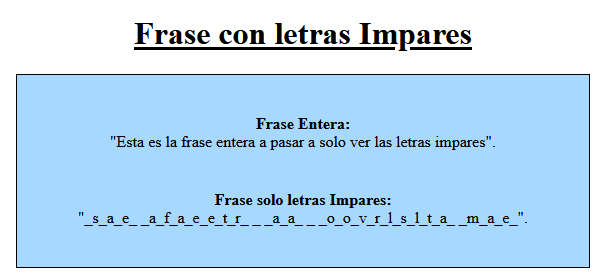
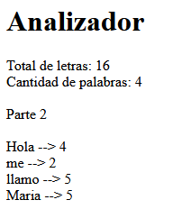
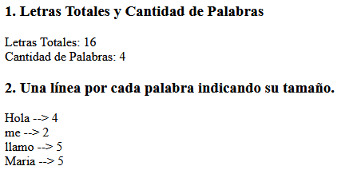
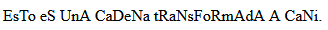
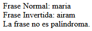
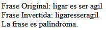

[`⬅️ Volver al Inicio`](https://github.com/13MariaNoguera/Ejercicios1-PHP "Inicio Ejercicios")
 

# 📝 Visualización Funciones Predefinidas

### 1️⃣ [1_fraseImpares.php](https://github.com/13MariaNoguera/Ejercicios1-PHP/blob/master/funcionesPredefinidas/1_fraseImpares.php "1_fraseImpares.php")
Este ejercicio lee una frase y devuelve una nueva cadena que contiene solo los caracteres de las posiciones impares de la frase original.

[`➡️ Ver código`](https://github.com/13MariaNoguera/Ejercicios1-PHP/blob/master/funcionesPredefinidas/1_fraseImpares.php "1_fraseImpares.php")

---

### 2️⃣ [2_analizador.php](https://github.com/13MariaNoguera/Ejercicios1-PHP/blob/master/funcionesPredefinidas/2_analizador.php "2_analizador.php")
Este ejercicio analiza una frase en la que las palabras están separadas por espacios y realiza las siguientes operaciones:
- Devuelve el total de letras y el número de palabras.
- Muestra una línea para cada palabra indicando su longitud.

**Nota:** No se permite usar la función `str_word_count`.

[`➡️ Ver código`](https://github.com/13MariaNoguera/Ejercicios1-PHP/blob/master/funcionesPredefinidas/2_analizador.php "2_analizador.php")

---

### 3️⃣ [3_analizadorWC.php](https://github.com/13MariaNoguera/Ejercicios1-PHP/blob/master/funcionesPredefinidas/3_analizadorWC.php "3_analizadorWC.php")
En este ejercicio se investiga cómo funciona la función `str_word_count()` y se realiza nuevamente el análisis de la frase, similar al ejercicio anterior, pero utilizando esta función predefinida.

[`➡️ Ver código`](https://github.com/13MariaNoguera/Ejercicios1-PHP/blob/master/funcionesPredefinidas/3_analizadorWC.php "3_analizadorWC.php")

---

### 4️⃣ [4_cani.php](https://github.com/13MariaNoguera/Ejercicios1-PHP/blob/master/funcionesPredefinidas/4_cani.php "4_cani.php")
Este ejercicio implementa una función que transforma una cadena de texto en "Cani". Es decir, altera el texto haciendo que las letras alternen entre mayúsculas y minúsculas.

[`➡️ Ver código`](https://github.com/13MariaNoguera/Ejercicios1-PHP/blob/master/funcionesPredefinidas/4_cani.php "4_cani.php")

---

### 5️⃣ [5_palindromo.php](https://github.com/13MariaNoguera/Ejercicios1-PHP/blob/master/funcionesPredefinidas/5_palindromo.php "5_palindromo.php")
Este ejercicio crea una función que comprueba si una palabra es un palíndromo, es decir, si se lee igual de izquierda a derecha que de derecha a izquierda. Un ejemplo de palíndromo es: "ligar es ser agil".

[`➡️ Ver código`](https://github.com/13MariaNoguera/Ejercicios1-PHP/blob/master/funcionesPredefinidas/5_palindromo.php "5_palindromo.php")

---
